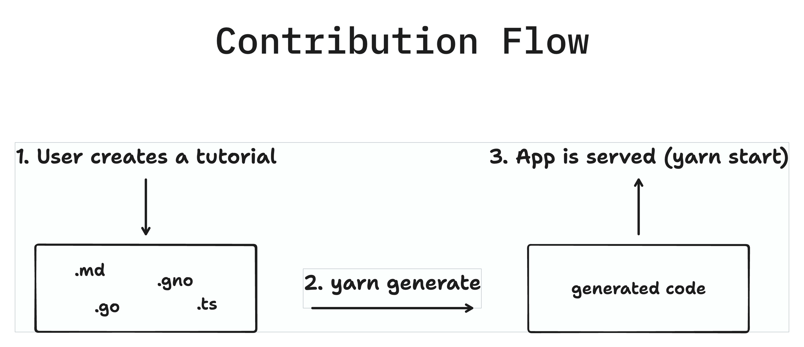

<h2 align="center">⚛️ Gno By Example ⚛️</h2>

[](https://app.netlify.com/sites/gno-by-example/deploys)

## Overview

`Gno By Example` is a community-dedicated web app that showcases the fundamentals of Gnolang, the Smart Contract
language
used on [Gno.land](https://gno.land).

## Contributing

The base application is built with `React` and utilizes the `Chakra UI` framework. You will need `Node v20+` to run it
locally.

Since the project is community-run, users can contribute new tutorials or modify existing ones.

As a community-driven project, users are welcome to contribute by creating new tutorials or modifying existing ones.

All tutorials are located within the `./src/tutorials/gno.land/gbe` subdirectory. Tutorials are automatically generated
from corresponding `.md` files, with each tutorial having its own subdirectory.



### Generating tutorials

After making modifications to tutorial files (`.md` or other resources), it is necessary to regenerate the global list
of tutorials by running the following command:

```bash
yarn generate
```

This command executes the tutorial route generation script, ensuring that all tutorials are up to date and ready for
dynamic display. Make sure to run this command from the repository root.

### Markdown format

Tutorials can be written using Markdown syntax.

#### Metadata header

A markdown header with some specific metadata is mandatory. This makes it possible for the tutorial generator script to
correctly parse and organize examples.
`title` and `section` values have to be set as part of the metadata at the top of the markdown file:

```md
---
title: Example Title
section: Example Section
---
```

#### Code snippets

In Gno By Example, there is a special feature that allows referencing entire external files or specific line numbers
from those files, outside of the Markdown files themselves.

To embed the entire content of a specific file inside a code segment, use the following syntax:

````md
```go file=./myFile.gno
```
````

To embed specific line numbers from an external file inside a code segment, use the following syntax:

````md
```go file=./myFile.gno#L1-L2
```
````

The above syntax will embed the content of the first two lines (inclusive) from the `./myFile.gno` file.

If your sample code relies on another code, you can define the dependencies. Each dependency code will be shown in a separate tab.
A typical scenario occurs when your sample code is a test file. In order for your test file to be executable, you need to include the actual implementation as a dependency.
To define dependencies, use the following syntax: 
```md
```go file=./myFile_test.gno depends_on_file=./myFile.gno,./myOtherFile_gno
```
```
